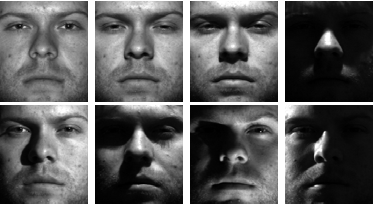

<br/>
<p align="center">
  <a href="https://github.com/rain-ho/eigenfaces">
    
  </a>
  <h3 align="center">Eigenfaces
</h3>

  <p align="center">
    Facial Recognition
    <br/>
    <br/>
    <a href="https://github.com/rain-ho/eigenfaces"><strong>Explore the docs »</strong></a>
    <br/>
    <br/>
    <a href="https://github.com/rain-ho/eigenfaces">View Demo</a>
    .
    <a href="https://github.com/rain-ho/eigenfaces/issues">Issues</a>
    .
    <a href="https://github.com/rain-ho/eigenfaces/discussions">Discussions</a>
  </p>
</p>


## Table Of Contents

* [About the Project](#about-the-project)
  * [Introduction](#introduction)
  * [Purpose](#purpose)
  * [Methodology](#methodology)
  * [How to Use](#How-to-use)
     * [Notes](#notes)
* [Contributing](#contributing)
  * [Creating A Pull Request](#Creating-a-pull-request)
* [Authors](#authors)


# About This Project - Eigenfaces Recognition

## Introduction

Eigenfaces Recognition is a facial recognition technique based on the concept of Eigenfaces, which are the principal components obtained from a set of face images. This project aims to implement and explore the Eigenfaces method for face recognition and demonstrate its effectiveness in identifying and verifying individuals from a dataset of facial images.

## Purpose

The purpose of this project is to showcase the application of the Eigenfaces algorithm as a powerful tool for face recognition tasks. By using the Eigenfaces approach, we can efficiently represent and recognize faces, making it an attractive solution for various applications such as access control, surveillance systems, and personalized user interfaces.

## Methodology

The Eigenfaces algorithm follows a series of steps:

1. **Data Collection**: A dataset of face images is collected, where each image represents a different individual.

2. **Preprocessing**: The collected images are preprocessed to ensure uniformity and reduce variations in lighting, scale, and orientation.

3. **Feature Extraction**: The principal components (Eigenfaces) are computed using the Singular Value Decomposition (SVD) on the covariance matrix of the preprocessed image dataset.

4. **Recognition**: For recognition, an input face image is projected onto the Eigenfaces subspace, and its distance to each known individual's mean face is calculated.

5. **Matching**: The input face is classified based on the closest match to the mean face of a known individual, thus identifying the most probable subject.

## How to Use

1. **Dataset**: Prepare a dataset of facial images, ensuring that each image corresponds to a unique individual. The more diverse and representative the dataset, the better the recognition performance.

2. **Training**: Implement the Eigenfaces algorithm on the dataset to compute the Eigenfaces and the mean face. These will form the basis of the recognition model.

3. **Recognition**: For face recognition, project the test face onto the Eigenfaces subspace and calculate its distance to the mean faces of the known individuals.

4. **Threshold**: Define a threshold value to determine whether the test face belongs to a known individual or if it should be rejected as an unknown face.

5. **Results**: Analyze the recognition results and evaluate the performance of the Eigenfaces method on the dataset.

### Notes

* Dataset Variability: It is important to note that the performance of the Eigenfaces method heavily relies on the variability present in the dataset. If the dataset lacks sufficient variations in facial expressions and lighting conditions for each subject, the recognition accuracy may be limited. Consider augmenting the dataset with additional images or employing techniques like data augmentation to improve the model's generalization.

* Individual Training: In cases where the dataset's variability is limited, an alternative approach was adopted to achieve better results. Each test image was trained individually, creating a separate recognition model for each test face. This maximizes the available training data for each face and can potentially enhance the recognition accuracy. However, it's important to consider the trade-offs of this approach. Training each test image individually can lead to a significant increase in computational overhead and memory requirements, especially for large datasets. As the dataset grows, this approach may become less feasible due to scalability issues.

* Independent Comparison: During recognition, the test images were not solely compared against the mean faces of the subjects. Instead, they were compared against every image in the dataset independently. This approach allows for a more fine-grained comparison, considering the unique features of each image in the dataset. This may not be the best approach specially if the dataset is big enough but it produced better results.  This alternative approach, although not typically recommended for large datasets, yielded improved results in this specific context. While it may not be the most efficient strategy for large datasets, in scenarios where the dataset lacks sufficient variability or contains limited samples per subject, training each test image individually can enhance recognition accuracy.

* **FOR MORE DETAILS PLEASE MAKE SURE TO READ THE REPORT UPLOADED AS report.pdf**

# Contributing

Contributions are what make the open source community such an amazing place to be learn, inspire, and create. Any contributions you make are **greatly appreciated**.
* If you have suggestions for adding or removing projects, feel free to [open an issue](https://github.com/rain-ho/eigenfaces/discussions/new) to discuss it, or directly create a pull request after you edit the *README.md* file with necessary changes.
* Please make sure you check your spelling and grammar.
* Create individual PR for each suggestion.


## Creating A Pull Request

1. Fork the Project
2. Create your Feature Branch
```sh
git checkout -b feature/AmazingFeature
```
3. Commit your Changes
```sh
git commit -m "Added some AmazingFeature" -m "This is the AmazingFeature Description"
```
4. Push to the Branch
```sh
git push origin feature/AmazingFeature
```
5. Open a Pull Request

# Authors

* **[Rafa](https://github.com/rain-ho/)** - *Computer Science Student*
  
